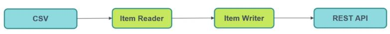

# Batch processing with Spring Boot and Spring Batch
## 1. Getting Started with Spring Batch:
1. Create First Spring Batch Application 1.0-spring-batch
2. Job with First Tasklet Step
3. Job with Second Tasklet Step
4. Customize Tasklet Step
5. Job Instance, Job Execution & Job Execution Context: 
   1. Job Instance, Job Execution:  
          <div align="center">
                   </img> 
          </div>
   2. Job Execution Context: context is at job level
          <div align="center">
                  </img> 
          </div>
6. Step Execution & Step Execution Context:
           <div align="center">
              </img> 
            </div>
7. Running Spring Batch with MySQL
8. Setting Job Parameter Value: 
   * With run configuration In program argument put "run=one", "run=two" "a=b" to show in DB table name "BATCH_JOB_INSTANCE" another instance
9. Make Job Parameter Unique: with unique id we resolve pb of parameter already exist 
10. Job Listener
11. Step Listener
## 2. Chunk Oriented Step
1. Chunk Oriented Step:
        <div align="center">
            </img> 
        </div>
   1. Create First Item Reader
   2. Create First Item Processor: has two parameter (input/output)
   3. Create First Item Writer
   4. Create Chunk Oriented Step
2. Chunk Oriented Step without Item Processor
   1. Change ItemWriter<Long>  to ItemWriter<Integer> 
   2. public void write(List<? extends Long> items) to public void write(List<? extends integer> items)
   3. Comment .processor(firstItemProcessor) 
   4. Change  .<Integer, Long>chunk(3) to  .<Integer, Integer>chunk(3)
   * So if we want to manipulate data we use the processor
3. Using chunk.size(4)
4. Tasklet & Chunk Oriented Steps Together   
## 3. Job Handling with REST API & Spring Scheduler
1. Job Launching Property: run application for new job instance in "program argument"
2. Spring Batch App with REST API
3. Start Job with REST API:
   1. Part 1
   2. Part 2: create JobService class
   3. In Postman execute request :localhost:8081/api/job/start/{jobName}
   4. Passing Job Parameters with REST API:
      * In the body of request :
       ```
        [
          {
         "paramKey" : "test",
         "paramValue" : "test123"
           },
           {
         "paramKey" : "abc",
         "paramValue" : "abc123"
          }
       ]
       ```
4. Scheduling Job with Spring Scheduler: [cronmaker](http://www.cronmaker.com/)
5. Stop Job with REST API
## 4. Working with Item Readers
1. Create First Spring Batch Application 2.0-spring-batch
2. Different Item Reader: CSV, JSON, XML, Database, REST API
3. Flat CSV File:
   1. Create csv file and Student model
   2. Create Flat File Item Reader with CSV File: FlatFileItemReader<StudentCsv> method
      <div align="center">
            
      </div>
   3. Item Reader with CSV File in Action 
   4. Change Delimiter with Flat File Item Reader
   5. Pass File Name as Parameter:  Edit configuration > argument parameter > inputFile=pathOfFile
   6. Customize Flat File Item Reader
4. JSON File as Datasource
   1. Create JSON Item Reader with CSV File: JsonItemReader<StudentJson> jsonItemReader method
      1. To ignore lastName field  @JsonIgnoreProperties(ignoreUnknown = true)
5. XML File as Datasource
   1. Add @XmlRootElement(name = "student") annotation on StudentXml class and the two
      dependencies:
      ```
         <!-- these 2 only required if java version > 8 -->
		   <dependency>
			  <groupId>jakarta.xml.bind</groupId>
			  <artifactId>jakarta.xml.bind-api</artifactId>
		   </dependency>
		   <dependency>
			  <groupId>org.glassfish.jaxb</groupId>
			  <artifactId>jaxb-runtime</artifactId>
           </dependency>
      ```
   2. Create XML Item Reader has error of version java 17
      * remove a dependency in a Maven project: mvn dependency:purge-local-repository
      * add dependency: 
       ```
          <dependency>
			   <groupId>org.springframework</groupId>
			   <artifactId>spring-oxm</artifactId>
			   <version>6.0.10</version>
          </dependency>
       ```
6. MySQl DB as Datasource
   1. Create JDBC Item Reader with MySQl DB
   2. Multiple Spring Datasource with MySQL
7. REST API as Datasource
   1. Create Application 3.0-spring-batch-rest-service
   2. Create REST API Item Reader
   3. Create REST Application 3.1-spring-rest-service
   4. Add some parameters to getStudent() method
## 5. Working with Item Writers
   * Use 2.0-spring-batch-processing App
1. Different Item Writer: CSV, JSON, XML, Database, REST API
2. Create Flat File Item Writer with CSV File
3. JSON Item Writer 
4. Working with Item Processor
5. XML Item Writer (pb in java 17 with jakarta.xml.bind)
6. CSV with Item Reader to Mysql DB with Item Writer 
   <div align="center">
            
   </div>
7. JDBC Item Writer Using Prepared Statement
8. Having POST API To Write
   <div align="center">
            
   </div>
   1. In 3.1-spring-rest-service App add createStudent method
      1. use restTemplate client to call createStudent methode in 3.0-spring... App
9. REST API Item Writer from csv file: create program parameter in run config for inputFile to read it 
## 6. Fault Tolerance with Spring Batch
* Create 4.0-fault-Tolerance-For-Spring-Batch-Job App:
1. Skip Bad Records
2. Capturing Bad Records While Reading Data
   1. Create 'Chunk Job' folder and 'First Chunk Step' inside this folder with the same name of chunkJob()
      and firstChunkStep() 
3. Capturing Bad Records While Processing Data
4. Capturing Bad Records While Writing Data
5. Capture Records using SkipListener
6. Retry Mechanism
## 7. Real Time Use Case with Database Migration
1. Database Migration (PostgreSQL To MySQL) with Spring Batch
   1. Create university db in PostgreSQL and MySQL
   2. Update source code by adding DatabaseConfig class and define the two Beans

      


