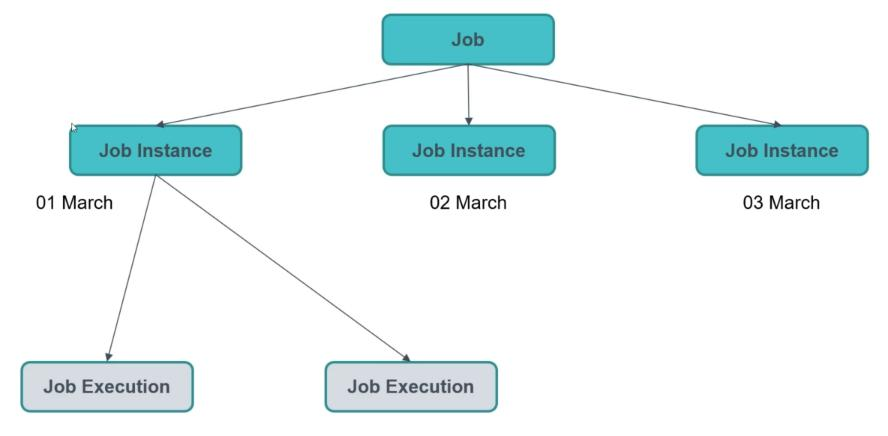
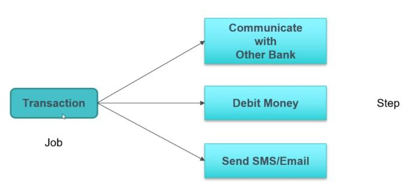
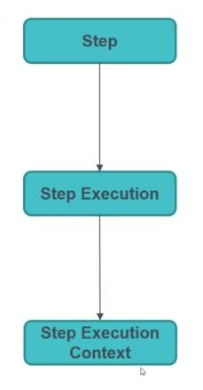
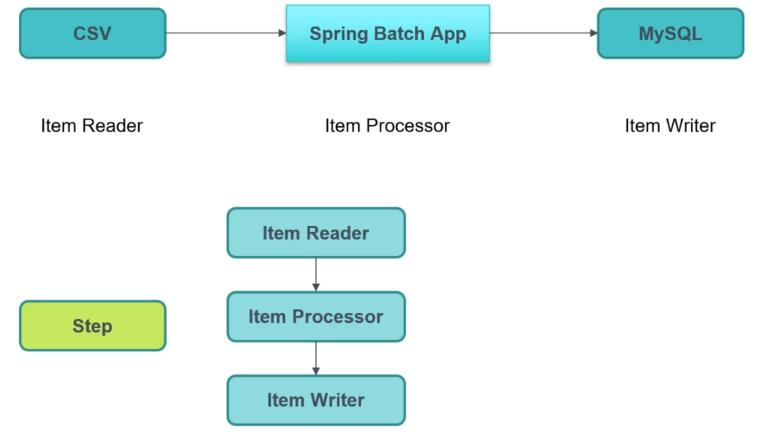
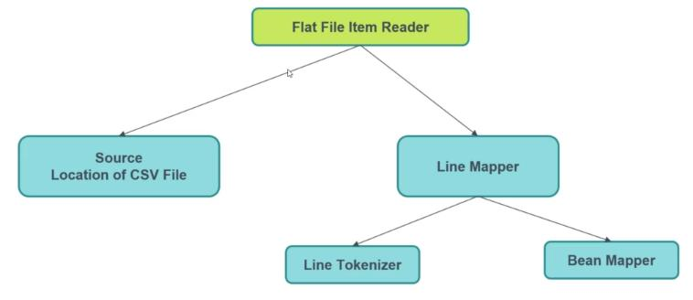

# Batch processing with Spring Boot and Spring Batch
## 1. Getting Started with Spring Batch:
1. Create First Spring Batch Application 1.0-spring-batch
2. Job with First Tasklet Step
3. Job with Second Tasklet Step
4. Customize Tasklet Step
5. Job Instance, Job Execution & Job Execution Context: 
   1. Job Instance, Job Execution:  
          <div align="center">
                   </img> 
          </div>
   2. Job Execution Context: context is at job level
          <div align="center">
                  </img> 
          </div>
6. Step Execution & Step Execution Context:
           <div align="center">
              </img> 
            </div>
7. Running Spring Batch with MySQL
8. Setting Job Parameter Value: 
   * With run configuration In program argument put "run=one", "run=two" "a=b" to show in DB table name "BATCH_JOB_INSTANCE" another instance
9. Make Job Parameter Unique: with unique id we resolve pb of parameter already exist 
10. Job Listener
11. Step Listener
## 2. Chunk Oriented Step
1. Chunk Oriented Step:
        <div align="center">
            </img> 
        </div>
   1. Create First Item Reader
   2. Create First Item Processor: has two parameter (input/output)
   3. Create First Item Writer
   4. Create Chunk Oriented Step
2. Chunk Oriented Step without Item Processor
   1. Change ItemWriter<Long>  to ItemWriter<Integer> 
   2. public void write(List<? extends Long> items) to public void write(List<? extends integer> items)
   3. Comment .processor(firstItemProcessor) 
   4. Change  .<Integer, Long>chunk(3) to  .<Integer, Integer>chunk(3)
   * So if we want to manipulate data we use the processor
3. Using chunk.size(4)
4. Tasklet & Chunk Oriented Steps Together   
## 3. Job Handling with REST API & Spring Scheduler
1. Job Launching Property: run application for new job instance in "program argument"
2. Spring Batch App with REST API
3. Start Job with REST API:
   1. Part 1
   2. Part 2: create JobService class
   3. In Postman execute request :localhost:8081/api/job/start/{jobName}
   4. Passing Job Parameters with REST API:
      * In the body of request :
       ```
        [
          {
         "paramKey" : "test",
         "paramValue" : "test123"
           },
           {
         "paramKey" : "abc",
         "paramValue" : "abc123"
          }
       ]
       ```
4. Scheduling Job with Spring Scheduler: [cronmaker](http://www.cronmaker.com/)
5. Stop Job with REST API
## 4. Working with Item Readers
1. Create First Spring Batch Application 2.0-spring-batch
2. Different Item Reader: CSV, JSON, XML, Database, REST API
3. Flat CSV File:
   1. Create csv file and Student model
   2. Create Flat File Item Reader with CSV File: FlatFileItemReader<StudentCsv> method
      <div align="center">
            
      </div>
   3. Item Reader with CSV File in Action 
   4. Change Delimiter with Flat File Item Reader
      


